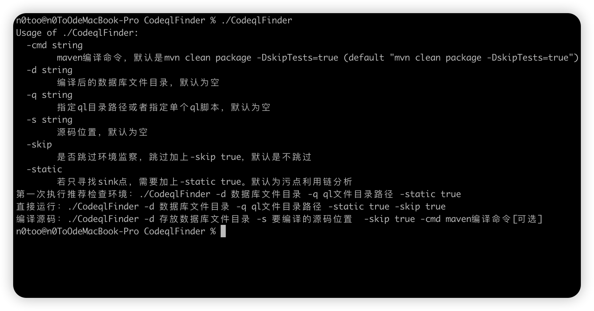
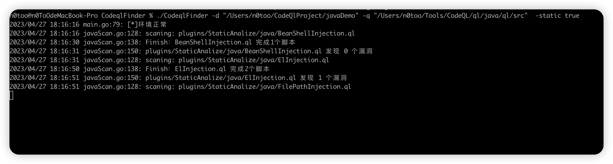
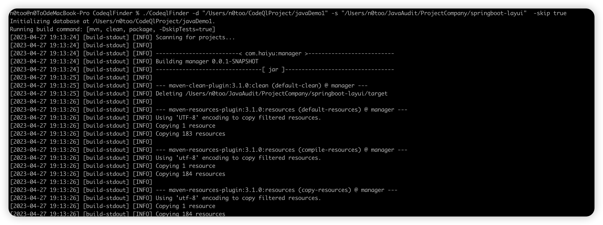

​	其实在学习和工作中，喜欢写成工具解决遇到的问题，或者萌生想法去写。但是一直认为自己的能力还有所缺陷，所以没有进行开源或者和大家分享，只是自己用。但是闭塞自己，永无法成长，因此打算把自己以前写的工具，以后写的工具都分享出来。

# CodeqlFinder

其实我是看到这个项目 ：感谢 https://github.com/webraybtl/CodeQLpy 

同时想用go写点东西学习一下。

所以用go语言实现的批量执行ql脚本的小工具，实现只搜索sink点或者污点利用链寻找

# 0x01 使用

第一次使用的话，推荐使用如下命令，检查当前环境是否适合正常。

`./CodeqlFinder -d 数据库文件目录 -skip false -q ql文件目录路径 -static true`

如果想编译源码成数据库的话，可以执行如下命令：

`./CodeqlFinder -d 存放数据库文件目录 -s 要编译的源码位置  -skip true`

所有结果和临时文件都是在`tempProject`目录下

# 0x02 参考项目

https://github.com/webraybtl/CodeQLpy
